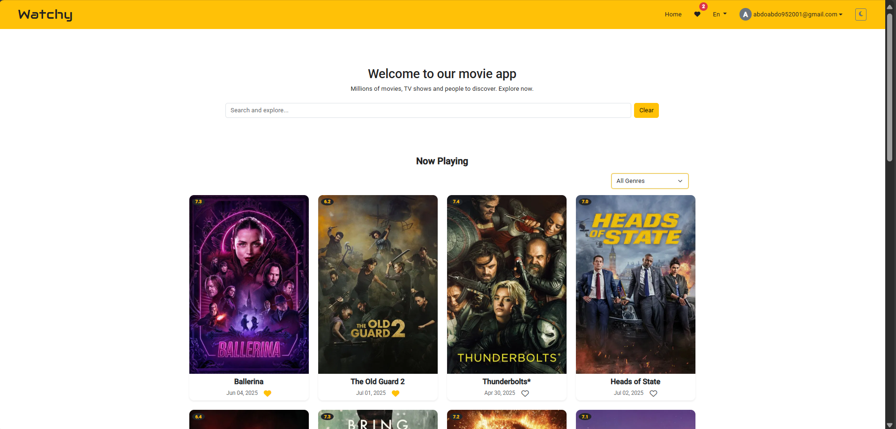
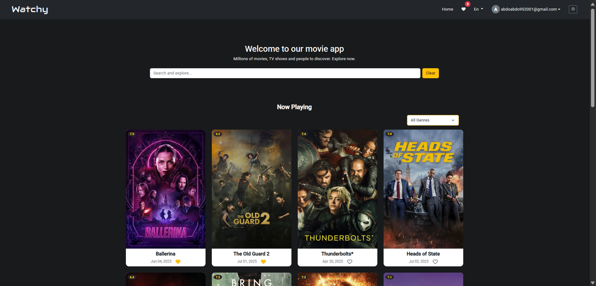
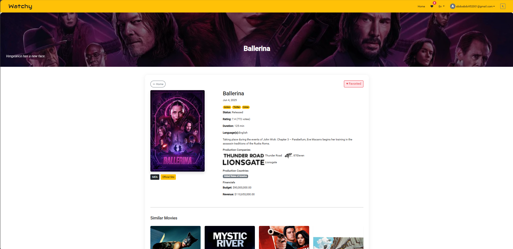
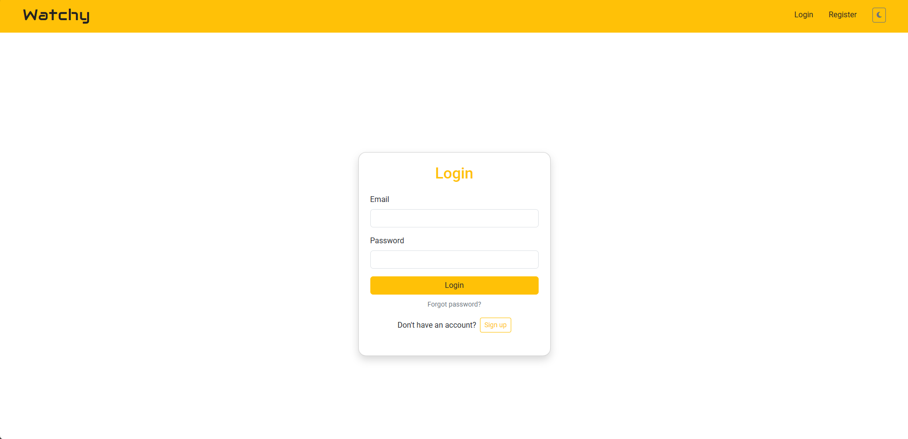

# 🎬 MovieApp

A modern movie browsing app built with Angular 20, integrated with [The Movie DB API](https://www.themoviedb.org/). Features include trending movies, search, detailed movie views, and user authentication with Firebase.

---

## 🚀 Live Demo

🔗 [Click here to visit the live app](https://movie-app-theta-amber.vercel.app/)

---

## 📸 Screenshots

### 🏠 Home Page


### 🏠 Home Page - dark


### 🔍 Movie Details


### 🔐 Login Page


---

## ⚙️ Tech Stack

- **Framework:** Angular 20
- **Styling:** Angular Material, SCSS
- **API:** The Movie DB
- **Authentication:** Firebase Auth (Google Sign-In)
- **Deployment:** Vercel 

---

## 🧪 Development Instructions

### 🖥️ Start Dev Server

```bash
ng serve
